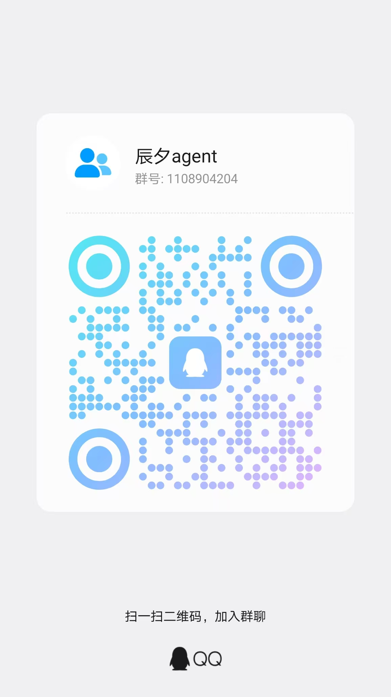

# 辰夕 WorkAgent

朝夕相伴的工作智能体（助手昵称「小梓」）。

**一个基于 Java 技术栈、可直接落地企业级智能体（Agent）项目的开源工程** —— 以 Java 17 + Spring Boot 3 + [agentscope-java](https://github.com/agentscope-ai/agentscope-java)（HarnessAgent）为核心，提供账号体系、BYOK 模型管理、SSE 流式对话、消息持久化、文件上传等生产可用的完整闭环，可作为企业内部 Agent 应用（智能办公助手、知识问答、流程自动化等）的脚手架快速二次开发。

## 为什么用 Java 做 Agent

主流 Agent 框架多以 Python 为主，但大量企业的技术资产、团队与合规体系建立在 Java 之上。本项目证明：**Java 完全可以承载生产级 Agent 应用**，并天然获得：

- **企业生态无缝接入**：Spring Boot 微服务体系、既有中间件（MySQL/Redis/对象存储）、公司统一认证与网关
- **工程化与可维护性**：强类型 + Maven 多模块分层，DDD 风格边界清晰，适合多人协作与长期演进
- **生产运维友好**：JVM 成熟的监控/诊断体系，配置外置、密钥加密、状态外置支持多实例水平扩展
- **团队复用**：无需引入 Python 技术栈，Java 团队即可独立完成 Agent 应用的开发、交付与运维

## 企业级落地特性

| 能力 | 说明 |
|---|---|
| 多租户账号体系 | 邮箱注册/登录、JWT 鉴权、个人资料、管理员角色 |
| BYOK 模型管理 | 用户自带 Key 接入 DeepSeek/Kimi/MiniMax/通义千问/OpenAI 兼容端点；apiKey **AES-GCM 加密存储**，永不回传前端；接入即连通性测试 |
| 流式对话闭环 | 自研 SSE 协议（事件枚举契约 + 序号 + Redis 断线补发缓存），思考/工具/文本增量实时推送 |
| 过程可观测 | 思考 → 工具调用 → 阶段结论的多轮循环聚合为步骤流（WorkBuddy 风格可展开步骤行），转写与回放一致 |
| 消息持久化 | MySQL `wa_message` 结构化存储（步骤流 JSON），历史会话随时回放 |
| 文件上传 | MinIO 对象存储，发起运行时自动落地会话工作区供 Agent 读取 |
| Docker 沙箱 | shell/Python 在容器内执行（每会话一容器、CPU/内存限额、默认断网），工作区 bind mount 投影，宿主机零污染 |
| HITL 参数补全 | 工具调用全放行（沙箱即安全边界）；任务缺参数时 `ask_user` 挂起弹表单，填答后续跑；快照存 Redis，重启后仍可恢复 |
| 技能市场 | 公共区（管理员维护）+ 我的技能（用户上传），zip 导入/导出/删除/文件树预览；对话输入区 @ 唤起技能收窄本轮技能目录 |
| MinIO 技能仓库 | 技能包存 MinIO（`public/`、`users/{uid}/` 分区），运行时按 ETag 判失效拉本地缓存，物化进工作区 `.skills-cache` 供沙箱执行技能脚本 |
| 产物归档 | Agent 产出文件经 `deliver_artifact` 归档 MinIO，右侧产物面板一键下载（预签名 URL） |
| 状态外置 | Agent 无状态化，会话状态存 Redis AgentStateStore，多实例下任意节点可续跑 |
| 配置外置 | 全部可调参数走 `workagent.*` ConfigurationProperties，环境变量可覆盖，密钥类配置强制生产覆盖 |

## 技术栈

- **后端**：Java 17、Spring Boot 3（MVC + SSE）、agentscope-java v2（ReAct/HarnessAgent）、MyBatis-Plus、Reactor
- **前端**：Vue 3 + Vite + TypeScript + Pinia，自研组件 + Markdown 流式渲染
- **中间件**：MySQL 8（持久化）、Redis 7（会话状态/事件缓存）、MinIO（文件/技能包）

## 仓库结构

```
├── docs/                     设计文档（PRD / 技术方案 / 可点击原型）
├── workagent-api/            Controller、SSE、全局异常
├── workagent-service/        业务编排（账号/模型/会话/运行/文件）
├── workagent-agent/          AgentFactory、模型工厂、工具、SSE 事件映射
├── workagent-infra/          MySQL/Redis/MinIO 配置与适配、常量、枚举、DO
├── workagent-server/         Spring Boot 启动模块（含 db/schema-m1.sql 与 DDL 导出）
├── web/                      前端（Vue 3 + Vite + TS + Pinia）
└── deploy/docker-compose.yml 依赖中间件（MySQL 8 / Redis 7 / MinIO）
```

## 本地启动

前置：JDK 17、Maven 3.9+、Node 18+、Docker（**M2 沙箱依赖 Docker daemon 运行中**，并提前拉取沙箱镜像 `docker pull python:3.11-slim`；沙箱可用 `workagent.sandbox.enabled=false` 整体关闭退回纯本地执行）。agentscope-java `2.0.3-SNAPSHOT` 需先安装到本地仓库：

```bash
cd ../agentscope-java
mvn install -DskipTests -Dmaven.javadoc.skip=true \
  -pl agentscope-harness,agentscope-extensions/agentscope-extensions-redis,agentscope-extensions/agentscope-extensions-mysql,\
agentscope-extensions/agentscope-extensions-model/agentscope-extensions-model-dashscope,\
agentscope-extensions/agentscope-extensions-model/agentscope-extensions-model-openai -am
```

```bash
# 1. 起中间件（MySQL 自动执行 schema-m1.sql 建库建表）
cd deploy && docker compose up -d

# 2. 起后端（:8080）
cd .. && mvn -pl workagent-server -am spring-boot:run

# 3. 起前端（:5173，/api 代理到 8080）
cd web && npm install && npm run dev
```

打开 http://localhost:5173 → 注册（邮箱即可，无验证码）→ 设置-模型管理添加模型（DeepSeek/Kimi/MiniMax/通义千问/OpenAI 兼容）→ 回到对话开始问答。

未添加模型时平台兜底使用 `dashscope:qwen-plus`，需配置环境变量 `DASHSCOPE_API_KEY`。

## 构建

```bash
# 后端
mvn clean package -DskipTests          # 产物：workagent-server/target/workagent-server-1.0.0-SNAPSHOT.jar
java -jar workagent-server/target/workagent-server-1.0.0-SNAPSHOT.jar

# 前端
cd web && npm run build                # 产物：web/dist
```

## 关键配置（workagent.*，均可被环境变量覆盖）

| 配置 | 环境变量 | 默认 |
|---|---|---|
| workagent.jwt.secret | JWT_SECRET | 开发默认值，**生产必须覆盖** |
| workagent.security.aes-key | AES_KEY | 16/24/32 字节，apiKey 加密用，**生产必须覆盖** |
| workagent.workspace-root | WORKSPACE_ROOT | /data/workagent/workspace |
| workagent.minio.endpoint | MINIO_ENDPOINT | http://localhost:9000 |
| workagent.agent.default-model-api-key | DASHSCOPE_API_KEY | 空（平台兜底模型） |
| workagent.admin.email | ADMIN_EMAIL | admin@chenxi.local |
| workagent.admin.password | ADMIN_PASSWORD | admin123456，**生产必须覆盖并尽快改密** |

## 路线图

- ✅ **M1**：账号体系、BYOK 模型管理、文件上传、SSE 对话闭环、消息持久化与历史回放、过程步骤流展示、内置 http_request 工具
- ✅ **M2**：Docker 沙箱执行（会话级隔离、资源限额、默认断网）、产物面板（deliver_artifact 归档 MinIO + 预签名下载）
- ✅ **M3**：技能市场（公共/我的分区、zip 导入导出删除、文件树预览）、MinIO 技能仓库（ETag 缓存 + 沙箱物化）、@ 唤起技能、HITL 参数补全表单（ask_user 挂起 → 填表续跑）
- ⏳ **M4**：记忆中心（文件式长期记忆）、多模型打磨、观测体系

## 沙箱与 HITL 配置（workagent.sandbox.*）

| 配置 | 默认 | 说明 |
|---|---|---|
| enabled | true | 关闭后退化为宿主机本地文件系统 |
| image | python:3.11-slim | 沙箱镜像（需带 python3），首次使用前请 `docker pull` |
| cpu-count / memory-size-bytes | 1 / 512Mi | 容器资源限额 |
| network | none | 默认断网，出网走宿主 `http_request` 工具 |
| hitl-expire-minutes | 10 | HITL 挂起（参数补全）快照超时，超时后 answer 返回「已过期」 |

**人机交互策略**（2026-09 调整）：工具调用全放行（权限 BYPASS）——文件类操作天然安全，
execute/shell_execute 跑在断网限额的一次性沙箱里，沙箱即安全边界，不再弹风险确认；
保留「参数补全」一条 HITL 链路：任务缺必需信息时小梓调用 `ask_user` 挂起，
前端弹表单收集参数，用户提交后从挂起点继续执行。

## 技能包格式（workagent.skill.*）

技能为一个 zip 包，根目录必须含 `SKILL.md`（YAML frontmatter 带 `name`/`description`，
`name` 即 skillKey，须匹配 `[a-z0-9][a-z0-9-]*`），其余文件（脚本/模板/参考文档）作为技能资源，
运行时装入 `<available_skills>` 目录供模型按需 `load_skill_through_path` 加载，
并物化到工作区 `.skills-cache/`（沙箱内路径 `/workspace/.skills-cache/...`）供脚本执行。
同名技能重复导入即覆盖更新（ETag 指纹判失效）；用户私有技能遮蔽同名公共技能。

| 配置 | 默认 | 说明 |
|---|---|---|
| max-size-mb | 10 | zip 包大小上限 |
| max-files | 100 | 包内文件数上限 |
| preview-max-size-kb | 256 | 文件树预览单文件大小上限 |
| list-cache-seconds | 5 | 技能可见列表内存缓存 TTL |
| skill-cache-root | ./data/workagent/skill-cache | 本地物化缓存根目录 |

## 社区与联系

欢迎加入 QQ 交流群「辰夕agent」（群号：**1108904204**），反馈问题、交流企业智能体落地经验：


